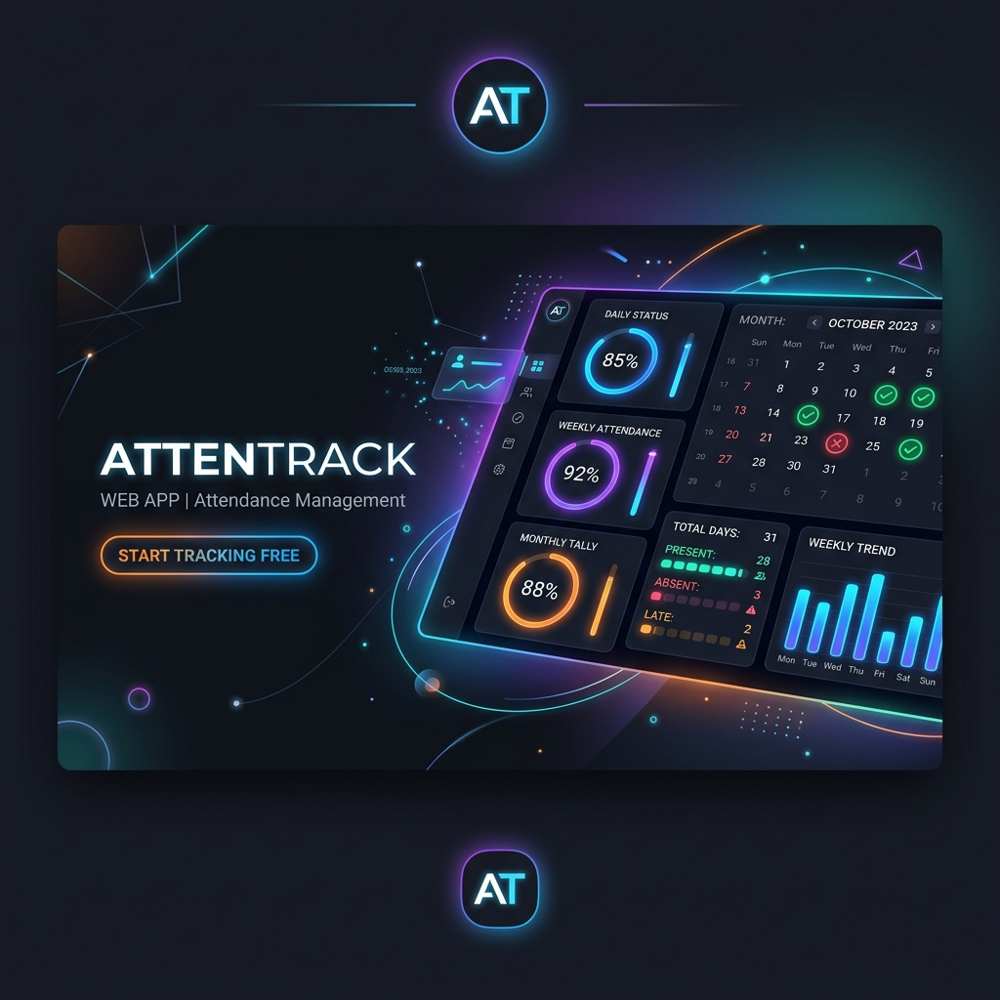

# AttenTrack 📊



An elegant, interactive attendance tracker and simulation web application designed specifically for college students. AttenTrack combines a premium dark-mode aesthetic with powerful utility features, letting you stay on top of your attendance targets with ease.

🚀 **[View Live on Vercel](https://attentrack-one.vercel.app/)**

---

## 🌟 Key Features

* **Visual Attendance Dashboard**: Monitor your overall attendance percentage and safety status through progress rings and real-time alerts.
* **Smart "What-If" Simulator**: Run scenarios to predict how your attendance percentage will change if you attend or skip a specific number of upcoming classes.
* **Weekly Timetable Planner**: Maintain a fully customizable weekly schedule that highlights today's classes dynamically.
* **Timetable OCR Scanner**: Import your weekly class schedule directly from PDF or image files (powered by client-side Tesseract.js OCR).
* **Firebase Cloud Sync**: Securely sign in with Google to backup and sync your subjects, schedule, and attendance data across multiple devices.
* **Premium User Experience**: Styled with modern typography (Plus Jakarta Sans), vibrant glassmorphism accents, and responsive layout for mobile and desktop screens.

---

## 🛠️ Technology Stack

- **Core**: Vanilla HTML5, ES6+ JavaScript, and responsive CSS3.
- **UI Design**: CSS custom properties, backdrop filters (glassmorphism), and Lucide Icons.
- **OCR Parsing**: [Tesseract.js](https://tesseract.projectnaptha.com/) & [PDF.js](https://mozilla.github.io/pdf.js/) for client-side text extraction.
- **Backend Services**: [Firebase SDK](https://firebase.google.com/) (Authentication & Firestore Database).

---

## 🚀 How to Run Locally

1. **Clone this repository**:
   ```bash
   git clone https://github.com/kanishkachaudharyvr-cmyk/AttenTrack.git
   cd AttenTrack
   ```
2. **Install development dependencies**:
   ```bash
   npm install
   ```
3. **Run a local development server**:
   You can open `index.html` directly in your browser or run it using a local server extension (e.g., Live Server in VS Code).

---

## 🏷️ GitHub Repository Metadata

Use these details to set up the **About** section of your GitHub repository:

* **Description**:
  > A beautiful, interactive attendance tracker and simulator web app for college students featuring timetable imports, OCR scanning, and Firebase cloud sync.
  
* **Suggested Topics (Tags)**:
  `attendance-tracker` · `student-utilities` · `tesseract-js` · `ocr` · `firebase` · `glassmorphism` · `javascript` · `single-page-app` · `vercel-deployment`
